# Alder Grove — Architecture Flows

## Request Flow (Desktop → API)

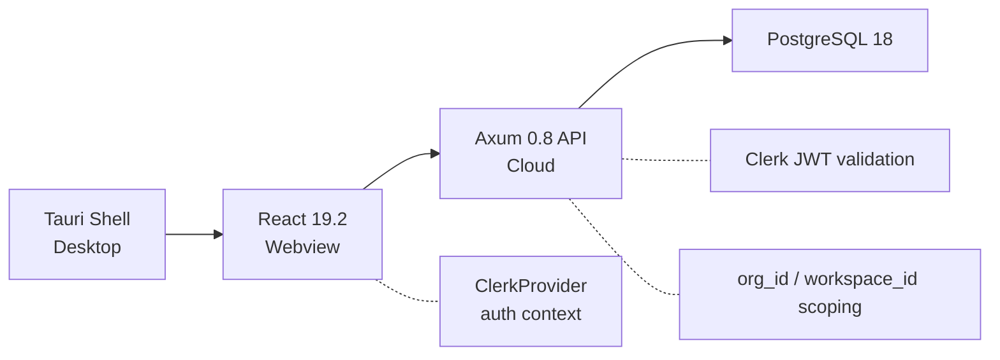

## Hexagonal Dependency Flow

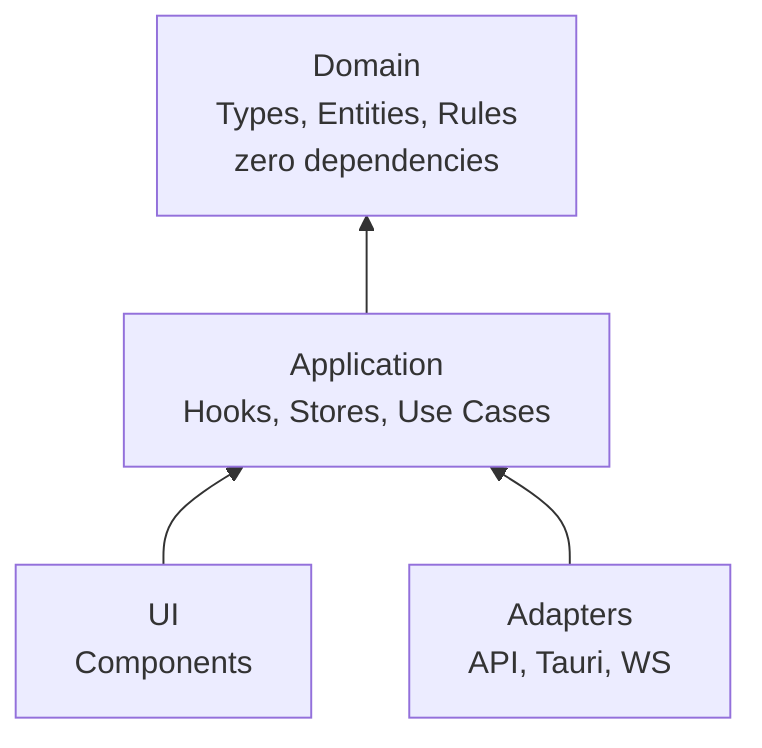

Dependencies flow inward. Domain has zero external dependencies.

## ACP Session Lifecycle

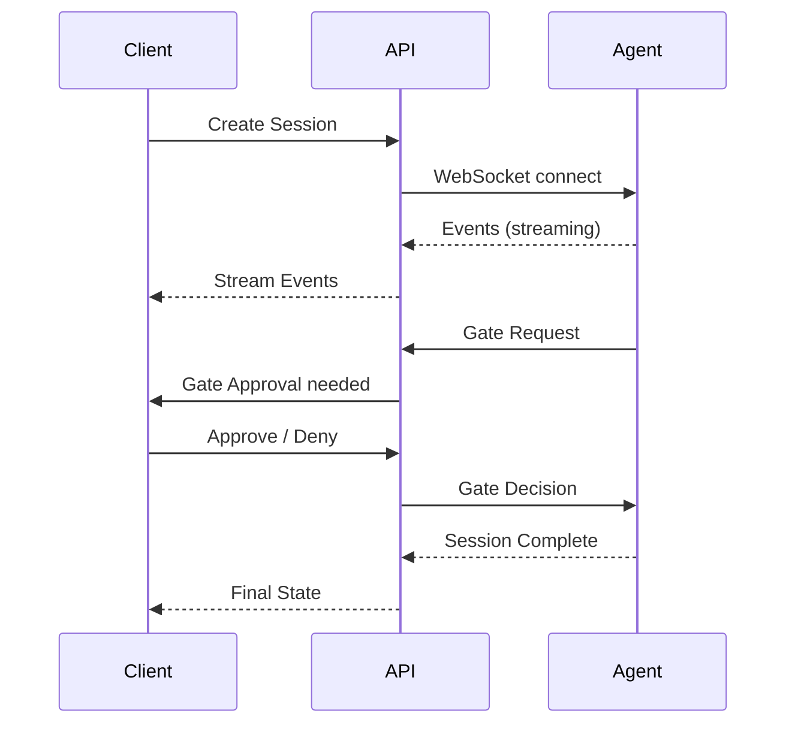

## Session State Machine

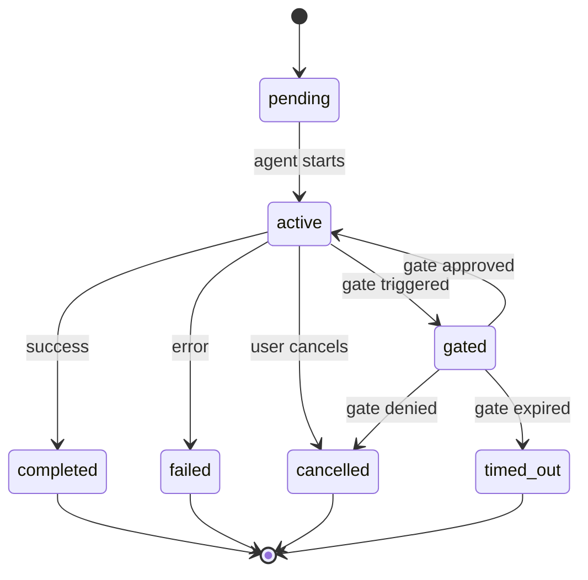

## Gate & Guardrail Enforcement Flow

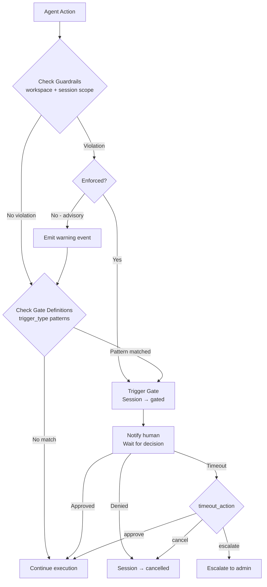

## CRDT Sync Flow

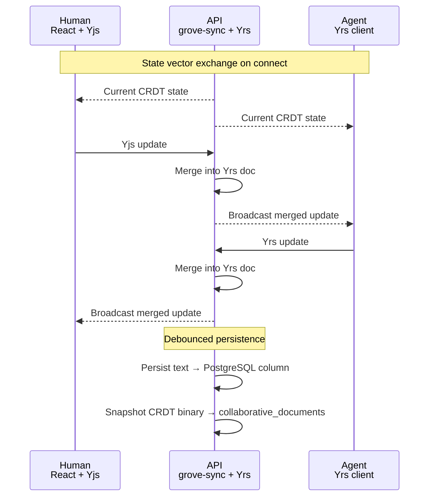

## Awareness / Presence Protocol

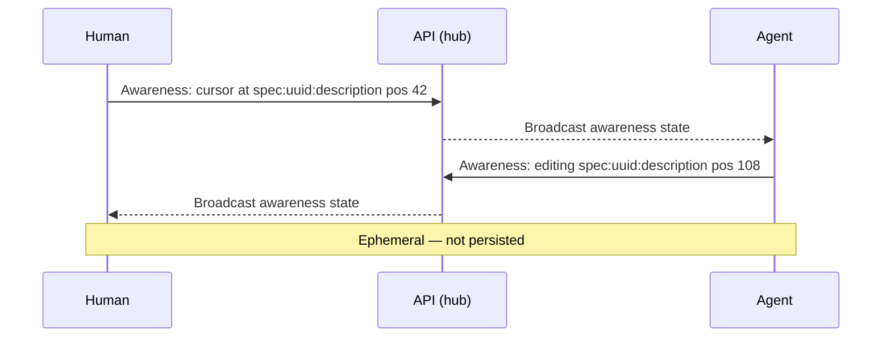

Awareness state carries: user identity (id, name, color, type), cursor position (entity, field, offset, selection), and activity label.

## WebSocket Multiplexing

Single WebSocket connection per client, carrying three tagged channels:

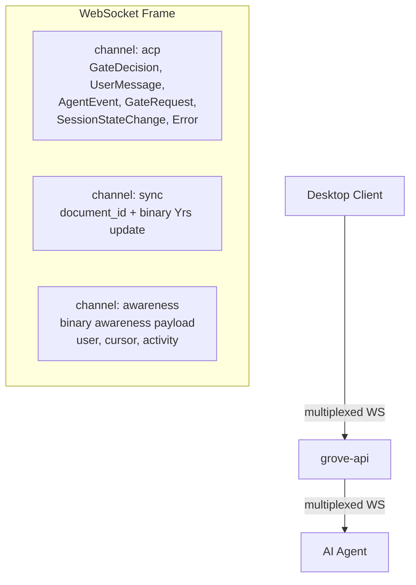

## Crate Dependency Graph

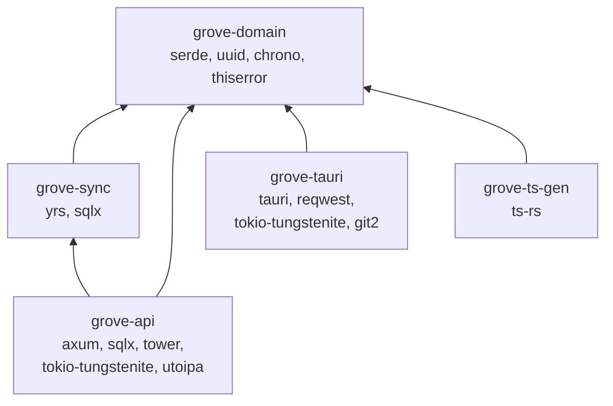

**Rules:**
- `grove-domain` has ZERO framework dependencies
- Dependencies flow toward `grove-domain` (inward)
- `grove-api` is the only crate that depends on `grove-sync`
- `grove-tauri` and `grove-api` never depend on each other

## Tauri IPC Proxy Flow

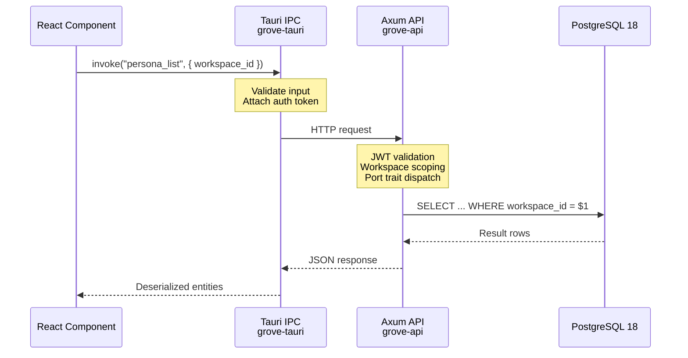

Frontend never hits the API directly. Auth token is managed in Rust, not exposed to the webview.

## Multi-Tenant Data Flow

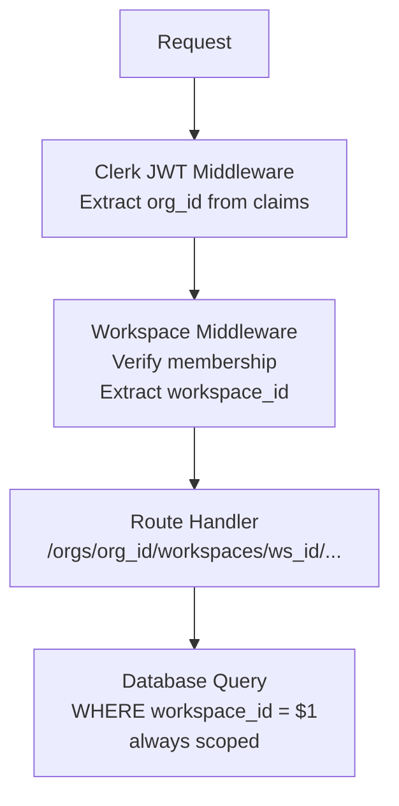

## Shell Extension Registration

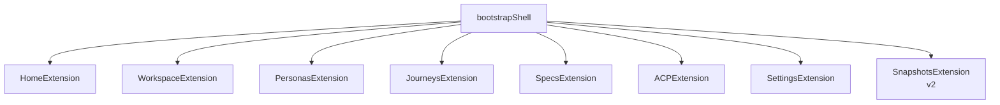

Each extension provides:
- Navigation entry
- Route definitions
- Feature-scoped Zustand store
- Self-contained UI components
