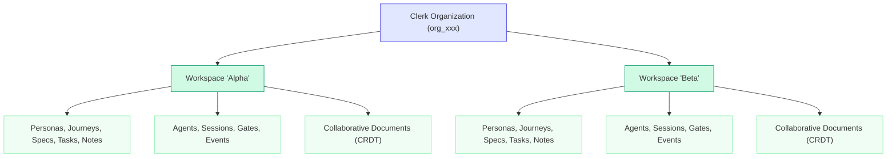
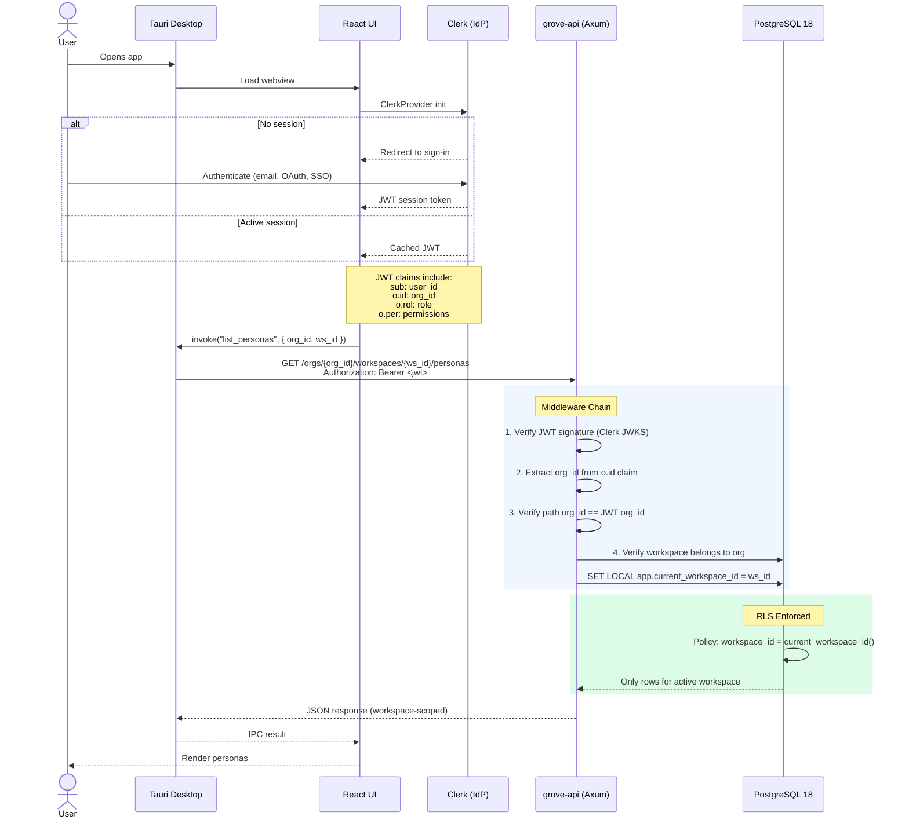
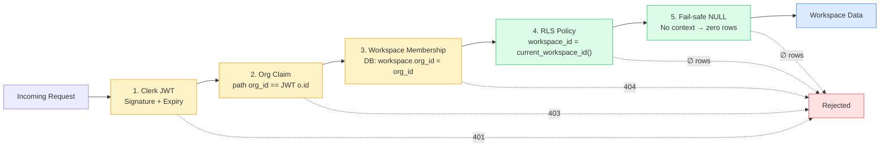
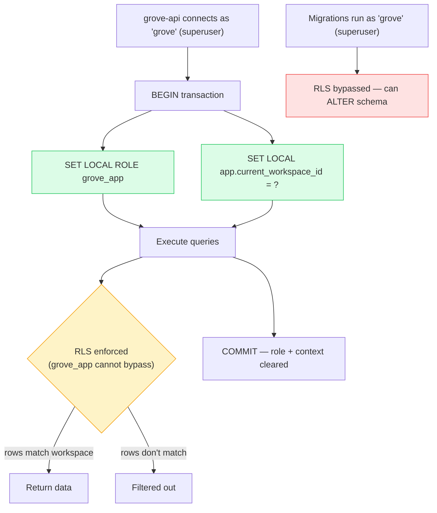

# Authentication, Authorization & Multi-Tenancy

> How Alder Grove identifies users, enforces organization boundaries, and
> isolates workspace data at every layer of the stack.

---

## Tenant Model



**Organization** = the tenant boundary. Managed entirely by Clerk (billing,
invites, member roles). Maps 1:1 to `org_id` in the database.

**Workspace** = a project container within an organization. Users in the same
org can create and manage multiple workspaces. Users in different orgs cannot
see each other's workspaces, data, or agent sessions.

---

## User Flow: End-to-End



### JWT Claims Structure

```json
{
  "sub": "user_abc123",
  "o": {
    "id": "org_xyz789",
    "rol": "admin",
    "per": "manage_workspaces",
    "slg": "acme-corp"
  },
  "exp": 1710000000
}
```

The `o` (organization) claim is only present when the user has an active
organization selected. If absent, the API rejects the request with 403.

---

## Defense-in-Depth Layers



| Layer | Mechanism | What it prevents |
|-------|-----------|-----------------|
| **1. Clerk JWT** | Signature verification, expiration | Unauthenticated access |
| **2. Org claim validation** | Path org_id must match JWT `o.id` | URL manipulation to access other orgs |
| **3. Workspace membership** | DB check: workspace.org_id = JWT org_id | Accessing workspaces outside your org |
| **4. RLS policies** | `workspace_id = current_workspace_id()` | Any query returning cross-tenant data |
| **5. Fail-safe NULL** | No context set → zero rows | Misconfigured middleware returning data |
| **6. FORCE ROW LEVEL SECURITY** | Applies even to table owners | Superuser bypass in application code |
| **7. WITH CHECK** | Validates writes, not just reads | Cross-tenant INSERT/UPDATE |

A bug at any single layer does NOT compromise tenant isolation — the next layer
catches it. This is the principle of defense-in-depth.

---

## Database Architecture

### Tenant Context Function

```sql
CREATE OR REPLACE FUNCTION current_workspace_id()
RETURNS uuid LANGUAGE sql STABLE SECURITY DEFINER
SET search_path = pg_catalog, public
AS $$
    SELECT NULLIF(current_setting('app.current_workspace_id', true), '')::uuid
$$;
```

- `SECURITY DEFINER` — prevents search_path injection attacks
- `NULLIF` — handles empty string after `RESET` (PostgreSQL 18 behavior)
- `current_setting(..., true)` — returns NULL instead of error when unset
- `STABLE` — optimizer can cache within a single statement

### RLS Policy Pattern

Every workspace-scoped table follows this pattern:

```sql
ALTER TABLE <table> ENABLE ROW LEVEL SECURITY;
ALTER TABLE <table> FORCE ROW LEVEL SECURITY;

CREATE POLICY workspace_isolation ON <table>
    FOR ALL
    USING  (workspace_id = current_workspace_id())
    WITH CHECK (workspace_id = current_workspace_id());
```

### Table Scoping Strategy

All 19 tables have a direct `workspace_id` column for O(1) RLS evaluation:

| Table | Scope | Notes |
|-------|-------|-------|
| `workspaces` | `id = current_workspace_id()` | Root table — policy on `id`, not `workspace_id` |
| `repositories` | Direct | `workspace_id` column |
| `personas` | Direct | `workspace_id` column |
| `journeys` | Direct | `workspace_id` column |
| `steps` | **Denormalized** | `workspace_id` added (also has `journey_id` FK) |
| `specifications` | Direct | `workspace_id` column |
| `step_specifications` | **Denormalized** | `workspace_id` added to join table |
| `tasks` | **Denormalized** | `workspace_id` added (also has `specification_id` FK) |
| `notes` | Direct | `workspace_id` column |
| `note_links` | **Denormalized** | `workspace_id` added (also has `note_id` FK) |
| `snapshots` | Direct | `workspace_id` column |
| `agents` | Direct | `workspace_id` column |
| `sessions` | Direct | `workspace_id` column |
| `gate_definitions` | Direct | `workspace_id` column |
| `gates` | **Denormalized** | `workspace_id` added (also has `session_id` FK) |
| `events` | **Denormalized** | `workspace_id` added (also has `session_id` FK) |
| `guardrails` | Direct | `workspace_id` column |
| `session_guardrails` | **Denormalized** | `workspace_id` added to join table |
| `collaborative_documents` | Direct | `workspace_id` column |

**Why denormalize?** Subquery-based RLS policies (e.g., `session_id IN (SELECT
id FROM sessions WHERE workspace_id = ...)`) degrade at scale. With millions of
events, a subquery on every read is expensive. Denormalizing `workspace_id` into
every table gives O(1) policy evaluation — the policy is a simple column
equality check, optimizable by the query planner via index.

**Composite FKs enforce consistency.** Each denormalized table uses composite
foreign keys like `(workspace_id, journey_id) REFERENCES journeys(workspace_id, id)`
to guarantee the denormalized `workspace_id` matches the parent's workspace.
This prevents a row from claiming one workspace while its parent FK points to
a different workspace — tenant integrity is enforced at the database level.

### Append-Only Enforcement (Events)

```sql
CREATE POLICY events_no_update ON events AS RESTRICTIVE FOR UPDATE USING (false);
CREATE POLICY events_no_delete ON events AS RESTRICTIVE FOR DELETE USING (false);
```

The events table is immutable. These policies prevent UPDATE and DELETE at the
database level, regardless of application code.

### Database Roles



| Role | Purpose | RLS |
|------|---------|-----|
| `grove` (superuser) | Migrations, schema changes | Bypasses RLS |
| `grove_app` (NOLOGIN) | Application queries via `SET ROLE` | Subject to RLS |

The application connects as `grove` but executes queries as `grove_app` via
`SET LOCAL ROLE grove_app` within each transaction. This ensures RLS is always
active for application queries while allowing migrations to bypass it.

---

## Tech Stack

| Component | Technology | Role |
|-----------|-----------|------|
| **Identity Provider** | [Clerk](https://clerk.com) | User auth, organizations, JWT issuance |
| **JWT Verification** | `jsonwebtoken` crate + Clerk JWKS | Signature validation in Axum middleware |
| **API Framework** | Axum 0.8 | Route handlers, middleware, extractors |
| **Database** | PostgreSQL 18 | Multi-tenant with RLS, uuidv7() PKs |
| **Tenant Isolation** | Row Level Security (RLS) | Database-enforced workspace boundaries |
| **Desktop** | Tauri v2 | JWT proxy, IPC bridge to React UI |
| **Frontend Auth** | `@clerk/clerk-react` | ClerkProvider, session management |
| **CRDT Sync** | Yrs (Rust) + Yjs (JS) | Real-time collaborative editing |

---

## Clerk Organization ↔ Alder Grove Mapping

| Clerk Concept | Alder Grove Concept | JWT Claim |
|---------------|--------------------|-----------|
| Organization | Tenant (org_id) | `o.id` |
| Organization Member | User with org access | `sub` |
| Organization Role | Org-level permission | `o.rol` |
| Organization Slug | URL-friendly tenant ID | `o.slg` |
| — | Workspace | Application-managed (DB) |

Clerk manages organizations, invitations, and member roles. Alder Grove
manages workspaces, entities, and workspace-level permissions within each
organization.

---

## API Route Structure

```
/orgs/{org_id}/workspaces                         # List/create workspaces
/orgs/{org_id}/workspaces/{ws_id}/personas         # Workspace-scoped CRUD
/orgs/{org_id}/workspaces/{ws_id}/journeys
/orgs/{org_id}/workspaces/{ws_id}/specifications
/orgs/{org_id}/workspaces/{ws_id}/sessions         # ACP session management
/orgs/{org_id}/workspaces/{ws_id}/ws               # WebSocket (ACP + CRDT)
```

The `{org_id}` path segment is validated against the JWT `o.id` claim in
middleware. The `{ws_id}` is validated against the database (workspace must
belong to the org). Both validations happen before any handler executes.

---

## Fail Modes

| Scenario | What happens |
|----------|-------------|
| Expired JWT | 401 Unauthorized — Clerk SDK auto-refreshes on client |
| No active organization | 403 Forbidden — user must select an org in Clerk |
| URL org_id ≠ JWT org_id | 403 Forbidden — middleware rejects before handler |
| Workspace not in org | 404 Not Found — workspace resolution fails |
| No `app.current_workspace_id` set | Zero rows — RLS fail-safe via NULL comparison |
| Direct DB access (bypassing API) | Zero rows — RLS enforced for `grove_app` role |
| SQL injection attempt | Parameterized queries (sqlx) — no string interpolation |

---

## Future Considerations

- **Workspace-level RBAC**: Clerk org roles are coarse (admin/member). Fine-grained
  workspace permissions (viewer, editor, admin) would be managed in the Alder
  Grove database, similar to project-alder's `AuthorizationService`.
- **Workspace invitations**: Invite users to specific workspaces within an org.
- **Audit logging**: All tenant-crossing attempts logged for security review.
- **Rate limiting**: Per-org API rate limits to prevent noisy-neighbor effects.

---

## References

- [Clerk Session Tokens](https://clerk.com/docs/guides/sessions/session-tokens)
- [Clerk Organizations](https://clerk.com/docs/guides/how-clerk-works/multi-tenant-architecture)
- [Clerk JWT Customization](https://clerk.com/docs/guides/sessions/customize-session-tokens)
- [PostgreSQL Row Level Security](https://www.postgresql.org/docs/18/ddl-rowsecurity.html)
- project-alder ADR-006 (Tenant Isolation Strategy)
- project-alder ADR-013 (Application-Layer Tenant Isolation)
